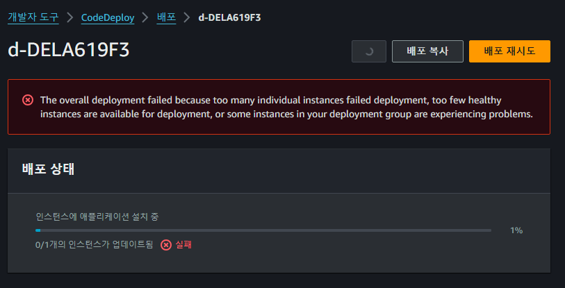
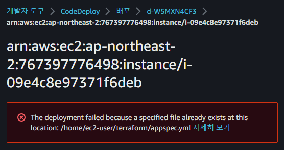

## CodeDeploy 안됨ㅠㅠ

### env
윈도우에서 수행

사내 wire 자료 및 링크 참고해서 [CD 파이프라인 구축](https://honglab.tistory.com/194)

### problem


View Events로 보니..



### solution
appspec.yml에 아래 한 줄 추가([링크](https://velog.io/@chldmswnl/AWS-The-deployment-failed-because-a-specified-file-already-exists-at-this-location-%EC%97%90%EB%9F%AC-%ED%95%B4%EA%B2%B0%ED%95%98%EA%B8%B0-feat.-github-action))

```yml
file_exists_behavior: OVERWRITE
```

