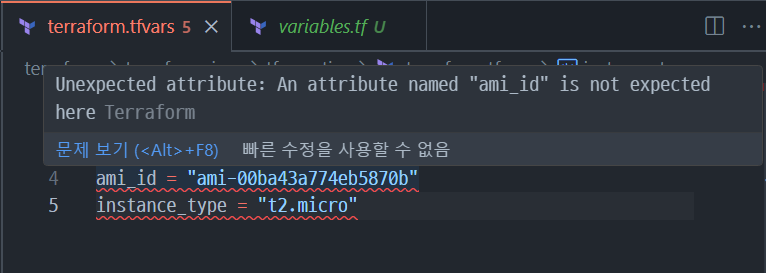

## 테라폼 *.tfvars 에러
### env
terraform 모듈 실습 중..

루트 디렉토리에서 변수 설정 중 에러 발생

### problem
모듈화 진행 중 다음과 같은 경고문 출력


### solution

`*.tfvars` 가 위치한 디렉토리에 variable 선언해주기만 하면 끝

예)

```
# vars.tf

variable "vpc_cidr_block" {}
variable "subnet_cidr_block" {}
variable "ami_id" {}
variable "instance_type" {}
```